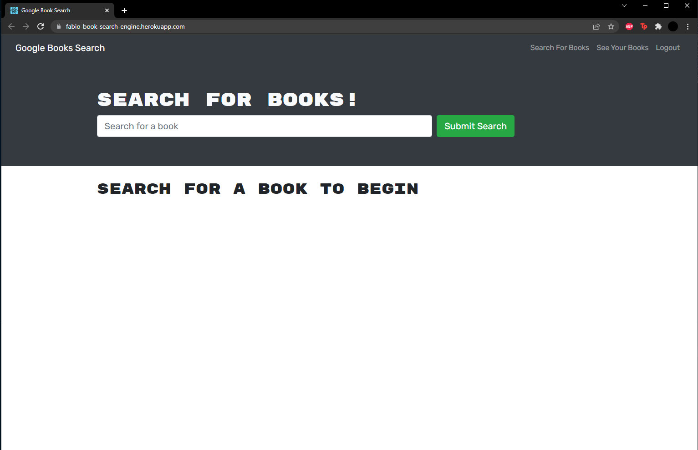
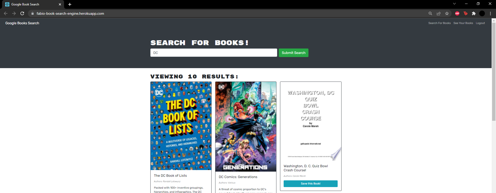
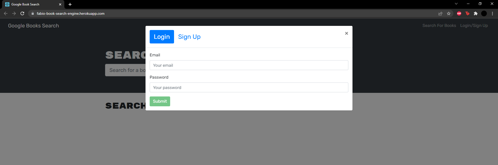
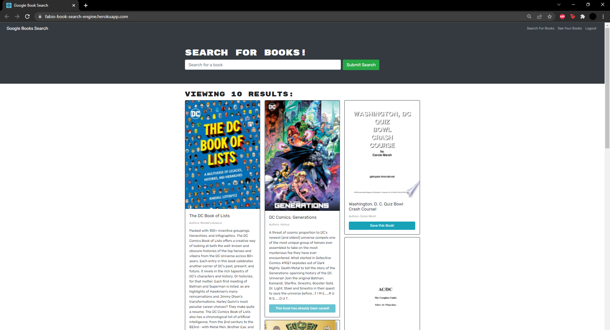
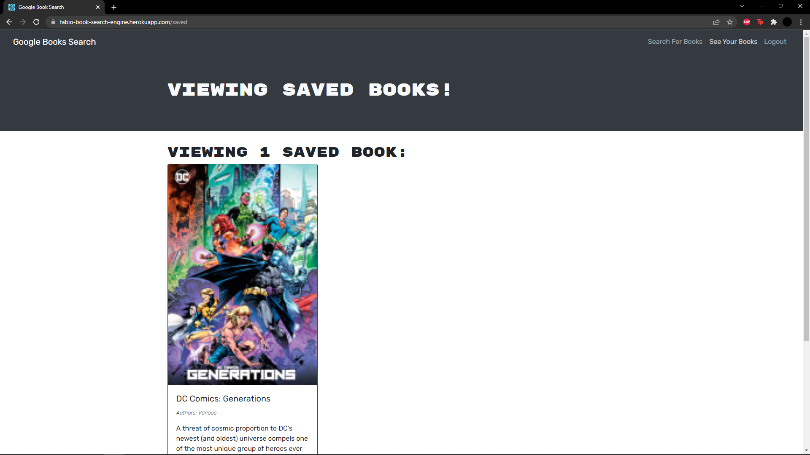

# Book Search Engine

## Description

This is a simple Full Stack application made with MERN, Node, React, MongoDB and ExpressJs.

## Application

[Deployed application](https://fabio-book-search-engine.herokuapp.com/)



## Table of Contents

- [Installation](#installation)
- [Usage](#usage)
- [Credits](#credits)
- [License](#license)
- [Contribute](#contributions)
- [Tests](#tests)
- [Questions](#questions)

## Installation

This is for local install if you want to deploy the appliaction yourself

1. clone repo on github
2. Install any required dependancies

```
    npm install
```

3. Start the application on nodeJS on dev mode

```
    npm run develop
```

## Usage

1. Once the application is started go to application website (Local: https://localhost:3000 Deployed: https://fabio-book-search-engine.herokuapp.com/ )
   
2. Login or Sign up to begin saving books   
   
3. Search and add books to your list  
   
4. View your saved books!   
   

## Credits

N/A

## License

This application is under the MIT License  
For more information please view here: [MIT Description](https://choosealicense.com/licenses/mit/)

[](https://opensource.org/licenses/MIT)

## Contributions

Feel free to clone and improve on this application!

## Tests

No Tests

## Questions

See more about my Github here: [Fchoi1](https://www.github.com/Fchoi1)  
Any burning questions you want to ask me?  
Reach out to me! [fwchoi@uwaterloo.ca](mailto:fwchoi@uwaterloo.ca)
